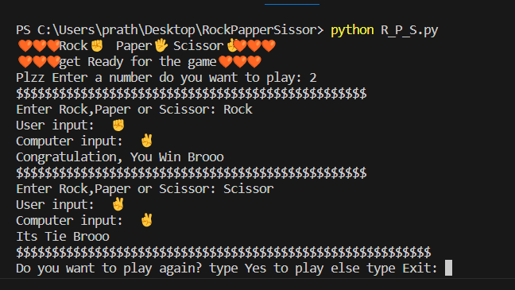

# Rock, Paper, Scissors Game

Welcome to the Rock, Paper, Scissors game repository! This project implements the classic game of Rock, Paper, Scissors in Python, allowing players to compete against the computer.

## Table of Contents

- [Introduction](#introduction)
- [Installation](#installation)
- [How to Play](#how-to-play)
- [Features](#features)
- [Contributing](#contributing)

## Introduction

Rock, Paper, Scissors is a simple yet entertaining game played between two players. Each player simultaneously selects one of three options: Rock, Paper, or Scissors. The winner is determined based on the choices made: Rock crushes Scissors, Scissors cuts Paper, and Paper covers Rock.

This repository contains a Python implementation of the game where players can compete against the computer.

## Installation

To run the Rock, Paper, Scissors game on your local machine, follow these steps:

1. Clone the repository to your local machine using the following command:
git clone https://github.com/PrathameshZ900/RockPaperScissors

2. Navigate to the directory of the game:
cd Project_1-Rock-Paper-Scissor-Game

3. Ensure you have Python installed on your system. This project is compatible with Python 3.

## How to Play

Once you've cloned the repository and navigated to the game directory, you can start playing the Rock, Paper, Scissors game. Follow these steps:

1. Run the game script:
python rps_game.py

2. You will be prompted to choose your move: Rock, Paper, or Scissors.

3. The computer will randomly select its move.

4. The game will determine the winner based on the choices made by both players.

5. Enjoy playing multiple rounds and see if you can outsmart the computer!

## Features

The Rock, Paper, Scissors game offers the following features:

- Simple command-line interface for easy interaction.
- Ability to play against the computer.
- Randomized computer moves to introduce unpredictability and challenge.
- Lightweight and easy-to-understand Python codebase.

## Contributing

Contributions to this project are welcome! If you'd like to suggest new features, report bugs, or contribute enhancements, please feel free to submit a pull request. Make sure to follow the project's coding style and guidelines.

## 🧡🖐️✊✌️ Rock, Paper, Scissor Game ✌️✊🖐️🧡

Get ready for an exhilarating game of Rock, Paper, Scissors! 🎮 Challenge the computer in a battle of wits and see who emerges victorious. 🏆

How to Play:

Enter the number of rounds you want to play.
Choose Rock ✊, Paper 🖐️, or Scissor ✌️ as your move.
Brace yourself for the computer's move.
💡 Tip: Check the emojis to visualize the moves:

Rock: ✊
Paper: 🖐️
Scissor: ✌️
Gameplay:

Each round unfolds with suspense as you and the computer reveal your moves.
Cheer for yourself when you win and learn from your defeats.
💥 Results and Scores:

Computer Score: 🤖 CamWin
Your Score: 👤 YouWin
Number of Ties: 🤝 Tie
Final Verdict:
After the intense battle, see who emerges as the ultimate champion! 🏅 Will it be you, the master strategist, or the computer with its unpredictable moves?

🔁 Play Again:
Feel the adrenaline rush? Type "Yes" to play again, or "Exit" to gracefully bow out.

🤗 Thank You for Playing:
Okk Byee!! Come again when you want to play. 😊 Your final scores await you!

❤️ Final Result of the Game:

Computer Score: CamWin
Your Score: YouWin
Number of Tie: Tie
🥳 The Verdict is In:
Celebrate if you won, console yourself if you lost, or smile at the tie. Either way, you're a Rock, Paper, Scissor champion in our hearts! 🏆🎉
